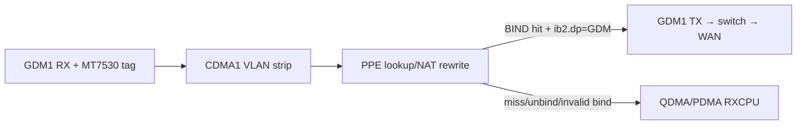

# EN751221 PPE/HNAT Hardware-Forward Checklist

There is no hidden "HW-forward master switch" beyond what you already have mostly correct. On HNAT-V2-class silicon, wire-speed forward is a **three-stage contract**: ingress must reach PPE, lookup must HIT a valid BIND entry, and ib2 must aim the rewritten frame at a **PSE egress port** (GDM1/GDM2), not back at CPU/QDMA. Your symptoms (classify OK, `RXHWF=0`, DRAM BIND ignored) point to stage 2/3 failure, not a missing global enable.

---

## Executive model



**`CDMA1_RXHWF_OK_CNT` (fe+0x594)** counts frames that completed the **hardware-forward chain to wire egress**, not "PPE classified successfully" and not "punted to CPU after BIND." If `RXCPU` climbs but `RXHWF` stays 0, PPE is running but every packet is exiting via the CPU path.

---

## Two port-numbering schemes (do not mix them)

| Namespace | Where used | PPE ingress | GDM1 wire egress | CPU punt |
|-----------|------------|-------------|------------------|----------|
| **CDM/GDM FWD nibble** (`GDM1_FWD_CFG[3:0]` etc.) | `ra_nat.c:SetGdmaFwd`, `mtk_eth_soc.c:mtk_gdm_config` | **4** = PPE | N/A | **0**=PDMA, **5**=QDMA |
| **PSE / ib2 DEST_PORT** (`MTK_FOE_IB2_DEST_PORT`, bits [7:5] on V1 80B) | `mtk_ppe.c:mtk_foe_entry_prepare`, `mtk_ppe_offload.c:mtk_flow_set_output_device` | N/A | **1** = `PSE_GDM1_PORT` | **0**=ADMA, **5**=QDMA_TX, **6**=QDMA_RX, **7**=DROP |

Your `GDM1_FWD_CFG=0x03f04444` (all classes → nibble **4** = PPE) is correct for **ingress** per `ra_nat.c:SetGdmaFwd` / `frame_engine.h:GDM1_*_P_PPE`.

Your `ib2=0x00fff0d0` decodes to **DEST_PORT=6** = `PSE_QDMA_RX_PORT` — that is a **CPU receive** target. It will never increment `RXHWF`.

---

## (a) What actually enables HW-forward vs CPU punt

There is no separate "RX-to-TX forward enable." The chain is:

### Tier 1 — PPE engine on (you have this)

| Priority | Register | Required | Source |
|----------|----------|----------|--------|
| P0 | `PPE+0x200` `MTK_PPE_GLO_CFG` bit0 `EN` | **1** | `mtk_ppe.c:mtk_ppe_start` writes `EN\|IP4_L4_CS_DROP\|IP4_CS_DROP\|FLOW_DROP_UPDATE` (=0x20d) |
| P0 | `PPE+0x204` `MTK_PPE_FLOW_CFG` | `IP4_NAPT` (bit13) + `IP4_NAT` (bit12) at minimum | `mtk_ppe.c:mtk_ppe_start`; your `0x0600f700` is in-family |
| P0 | `PPE+0x21c` `MTK_PPE_TB_CFG` `[5:4] SEARCH_MISS` | **3** = `FORWARD_BUILD` | `mtk_ppe.c:mtk_ppe_start`; `ra_nat.c:PpeSetFoeEbl` (`FWD_CPU_BUILD_ENTRY`) |

**Avoid** poking undocumented `GLO_CFG` bits (your 0x64d hang matches `TSID_EN`/`MCAST_TB_EN`/etc. in `mtk_ppe_regs.h`).

### Tier 2 — Ingress steering to PPE (you have this)

| Priority | Register | Required | Source |
|----------|----------|----------|--------|
| P1 | `fe+0x500` `GDM1_FWD_CFG` `[15:0]` | `0x4444` (U/B/M/O → PPE) | `ra_nat.c:SetGdmaFwd`; `mtk_eth_soc.c:mtk_gdm_config` uses `gdma_to_ppe[0]=0x4444` |
| P1 | `fe+0x400` `CDMA1_VLAN_CTRL` | OEM uses special-tag pop (your `0x81000001`) | Needed so PPE sees inner IPv4 past MT7530 tag |
| P1 | `fe+0x510` `GDMA1_VLAN_CHECK` | **1** (VLAN check on) | OEM / your notes |

**Check on stock OEM dump:** `GDM1_FWD_CFG[31:16]` — especially bit28 `L2LU_STAG_2CPU` (`mtk_eth_soc.h:MTK_GDMA_FWD_CFG` / `gdm_regs.h:GDM_FWD_CFG_L2LU_STAG_2CPU`). Your `0x03f04444` has **bit28 set**. That forces special-tag frames to CPU *unless* `CDMA1_VLAN_CTRL` strips the tag first. Confirm OEM's upper half.

### Tier 3 — The real blocker: valid BIND FoE entry (you are here)

HW wire-forward requires **all** of:

1. **LOOKUP tuple match** — engine's lookup parser must match `orig` 5-tuple in DRAM (your `econet_ppe.c` dual-parser issue: FORWARD_BUILD stores shifted tuples; LOOKUP uses real frame bytes → perpetual `HIT_UNBIND`/miss unless you SW-build the real tuple like OEM `PpeFillInL3Info`).
2. **`ib1.state = BIND` (2)** with `cah=1`, `ttl=1` for NAT flows.
3. **`ib2.DEST_PORT = 1`** for upstream WAN via conduit GDM1 (`mtk_ppe_offload.c:mtk_flow_set_output_device`: `PSE_GDM1_PORT`).
4. **`ib2.PORT_MG = ib2.PORT_AG = 0x3f`** — meter group 0 diverts to CPU (`econet_ppe.c` / `ra_nat.c:PpeSetInfoBlk2`).
5. **Complete L2 bind in FoE `l2` region**:
   - `new` tuple = post-NAT (WAN IP, ephemeral port)
   - DMAC = BRAS, SMAC = router WAN MAC
   - For PPPoE: `ib1` `BIND_PPPOE` + `l2.pppoe_id` (`mtk_ppe.c:mtk_foe_entry_set_pppoe`; `ra_nat.c:FoeBindToPpe`)
   - For cascaded MT7530: DSA in `l2.etype` (`mtk_ppe.c:mtk_foe_entry_set_dsa`; queue `3+port`)
6. **`ib1.timestamp` = live `FOE_TS`** (`fe+0x10`, 15-bit) at commit time.

There is **no** PDMA/QDMA "insert forward" bit beyond correct `DEST_PORT` + QOS queue. `mtk_eth_soc.c:mtk_start_dma` enables DMA; that's for CPU path only.

### Tier 4 — CPU-punt destination map (often overlooked)

| Priority | Register | OEM (QDMA) | Mainline | Source |
|----------|----------|------------|----------|--------|
| P2 | `PPE+0x248` `MTK_PPE_DEFAULT_CPU_PORT` | `0x55555555` (each nibble=5 QDMA) | `0` | `ra_nat.c:PpeEngStart` (mt7621); `mtk_ppe.c:mtk_ppe_start` |

Mismatch here affects **where punts land**, not whether forward works — but compare against stock.

### Tier 5 — Bind-rate / metering false punts

| Priority | Register | Check | Source |
|----------|----------|-------|--------|
| P3 | `PPE+0x228` `MTK_PPE_BIND_RATE` | `[15:0]` bind rate; `crsn=0x0f` = `HIT_UNBIND_RATE_REACHED` | `mtk_ppe.c:mtk_ppe_start`; `mtk_ppe.h:MTK_PPE_CPU_REASON_HIT_UNBIND_RATE_REACHED` |
| P3 | `PPE+0x230/22c` bind limits | quarter/half/full | `mtk_ppe.c:mtk_ppe_start` |

---

## (b) Correct `ib2.DEST_PORT` for upstream NAT → PPPoE WAN via GDM1→MT7530→WAN

For **80B V1 FoE** (your format), use **mainline PSE IDs** in `ib2[7:5]`:

| Port | ID | When |
|------|-----|------|
| `PSE_GDM1_PORT` | **1** | Upstream NAT egress via conduit GDM1 (this is your case) |
| `PSE_GDM2_PORT` | **2** | If WAN were GDM2 |
| `PSE_QDMA_RX_PORT` | **6** | Diagnostic: prove BIND hit by seeing flow stop (oracle) |
| `PSE_DROP_PORT` | **7** | Blackhole test |
| `PSE_QDMA_TX_PORT` | **5** | CPU TX injection, not wire forward |

`ra_nat.c:FoeBindToPpe` (mt7621 WAN path) sets `fpidx=1` → `iblk2.dp=1` with comment `/* 1: to GE1 (GSW P6) */` — same numeric value as `PSE_GDM1_PORT`.

**PPPoE upstream bind checklist** (from `mtk_ppe_offload.c:mtk_flow_offload_replace` + `ra_nat.c:FoeBindToPpe`):

```
ib1:  state=BIND, pkt_type=HNAPT, udp=0, cah=1, ttl=1, BIND_PPPOE=1
orig: pre-NAT 5-tuple (LAN view)
new:  WAN_IP : nat_port (post-NAT)
l2:   DMAC=BRAS, SMAC=router, pppoe_id=sid, etype=0x8864 after PPPoE set
ib2:  DEST_PORT=1, PORT_MG=0x3f, PORT_AG=0x3f (or 2 for WAN AG in RA_HWNAT)
      + QID/fqos if QDMA QoS mode (ra_nat QDMA path sets fqos+qid)
```

For MT7530 cascade egress, also call the equivalent of `mtk_foe_entry_set_dsa()` (port bitmap in `l2.etype`, `vlan_layer=1`) and `mtk_foe_entry_set_queue(eth, foe, 3+dsa_port)`.

---

## (c) Timestamp validity

**Short answer:** stale timestamp causes **aging invalidation** (entry silently dies after ~seconds), not **per-packet perpetual punt** while the entry is fresh.

| Item | Detail | Source |
|------|--------|--------|
| Timestamp source | `FOE_TS` at **`fe+0x10`**, mask 15 bits for BIND V1 | `mtk_ppe.c:mtk_eth_timestamp` (`eth+0x10`); `ra_nat.c:FoeBindToPpe` (`RegRead(FOE_TS)&0xFFFF`) |
| Write point | On every commit: `ib1[14:0] = FOE_TS` | `mtk_ppe.c:__mtk_foe_entry_commit` |
| Aging compare | Scanner uses same counter vs `BIND_AGE0/1` deltas | `mtk_ppe.c:mtk_ppe_start` (TCP delta=7, UDP=12) |
| Stale effect | Entry → `INVALID` after idle timeout; new packets get `NO_FLOW`/`FORWARD_BUILD` | `mtk_ppe.c:__mtk_foe_entry_idle_time` |

If you see **every packet** punt with `crsn=0x0e` (`HIT_UNBIND`) despite `state=BIND` in DRAM, that is **tuple/cache mismatch**, not timestamp.

---

## Prioritized poke/peek checklist (do in this order)

### 1. Decode `crsn` first (tells you which tier failed)

Read RX descriptor PPE CPU reason (`mtk_eth_soc.h:MTK_RXD4_PPE_CPU_REASON` or `MTK_RXD5_*` on v2).

| crsn | Meaning | Fix |
|------|---------|-----|
| `0x07` NO_FLOW | Lookup miss | Tuple/hash wrong |
| `0x0e` HIT_UNBIND | Hit but entry not BIND-valid | Tuple mismatch or cache serving UNBIND |
| `0x0f` HIT_UNBIND_RATE_REACHED | Bind rate limit | `PPE+0x228` |
| `0x16` HIT_BIND_FORCE_CPU | Meter/account group | `PORT_MG/AG` must be `0x3f` |
| `≥0x10` HIT_BIND_* | BIND recognized, punt for policy | Check VLAN/MTU/TTL/PPPoE violation bits |

### 2. Dump OEM **bound** FoE entry for same flow

Compare word-for-word against yours: `orig`, `new`, `ib1`, `ib2`, `l2` (MAC/VLAN/PPPoE/etype). OEM never trusts FORWARD_BUILD tuple — it SW-builds then only flips state (`ra_nat.c:FoeBindToPpe` + `foe_fdb.c:FoeSetEntryBind`).

### 3. Fix `ib2` egress (not 6)

```text
ib2 = (1 << 5)           # DEST_PORT = PSE_GDM1_PORT = 1
    | (0x3f << 12)       # PORT_MG
    | (0x3f << 18)       # PORT_AG
```

Re-test `RXHWF` at fe+0x594. Oracle: `DEST_PORT=7` should kill flow; `DEST_PORT=6` should land on CPU (no `RXHWF` — expected).

### 4. Verify ingress counters while flowing

```text
fe+0x590  CDMA1_RXCPU_OK_CNT    # should drop when forward works
fe+0x594  CDMA1_RXHWF_OK_CNT    # should climb on wire forward
fe+0x598  CDMA1_RXCPU_KA_CNT
fe+0x5a4  CDMA1_RXHWF_DROP_CNT
```

### 5. Compare stock vs yours — register block

| Offset | Name | What to match |
|--------|------|---------------|
| `fe+0x500` | `GDM1_FWD_CFG` | Lower `0x4444`; upper half (drop/STAG bits) |
| `fe+0x400` | `CDMA1_VLAN_CTRL` | Special-tag handling |
| `PPE+0x200` | `GLO_CFG` | Stay at 0x20d; don't set bit1/5/6/7 |
| `PPE+0x204` | `FLOW_CFG` | Must have bits 12+13 |
| `PPE+0x21c` | `TB_CFG` | `[5:4]=3` FORWARD_BUILD, bit3=80B, `[13:12]` keepalive=0 |
| `PPE+0x248` | `DEFAULT_CPU_PORT` | OEM `0x55555555` vs your `0` |
| `PPE+0x320/0x334` | CAH | EN751221 uses **0x334** gate (your RE); OEM clean-all via `0x4100` |
| `fe+0x10` | `FOE_TS` | Must be free-running when you stamp `ib1` |

### 6. QDMA / PSE (only if `crsn` shows BIND hit but no wire exit)

| Register | Role |
|----------|------|
| `fe+0x1a04` QDMA `GLO_CFG` `RX_DMA_EN\|TX_DMA_EN` | CPU path alive (already for RX) |
| `fe+0x100-0x108` PSE FC/drop | Check `PSE_OQ_TH` not starving GDM1 |
| `mtk_eth_soc.c:mtk_gdm_config` | Confirms no extra OR beyond `gdma_to_ppe` nibble |

---

## Direct answers to your three sub-questions

**(a)** The "enable" is not one bit. It is: `GLO_CFG.EN` + `FLOW_CFG.IP4_NAPT` + `TB_CFG.SEARCH_MISS=FORWARD_BUILD` + `GDM1_FWD_CFG→PPE(4)` + a **complete SW-built BIND entry** with `DEST_PORT=1` (GDM1) and full L2/NAT/PPPoE/DSA rewrite. Missing any of the FoE content keeps you in "classify + punt" even with `GLO_CFG` correct.

**(b)** Upstream via conduit GDM1: **`ib2.DEST_PORT = 1`** (`PSE_GDM1_PORT`). Not 4 (that's CDM ingress PPE nibble). Not 6 (QDMA RX / CPU). Full PSE map in `mtk_eth_soc.h:enum mtk_pse_port`.

**(c)** Timestamp must track live `FOE_TS` at commit; stale causes **age-out**, not frame-by-frame punt. Per-packet punt at BIND means lookup/L2/encap/port_MG problem, not timestamp.

---

## Highest-probability root cause given your data

1. **`DEST_PORT=6`** in `0x00fff0d0` aims at CPU — explains `RXHWF=0` regardless of cache/coherency (your cache-off A/B already proved that).
2. Even after fixing to `DEST_PORT=1`, you still need **OEM-style SW-built tuple + PPPoE L2 + DSA** — flipping the engine's auto-BIND slot in-place preserves the shifted FORWARD_BUILD tuple and guarantees `HIT_UNBIND` (`econet_ppe.c` rank-1 fix).
3. There is unlikely to be a ninth mystery register; dump OEM's bound entry for the same flow and diff it against yours — that diff is the remaining delta.

If you can paste one RX descriptor's `crsn` + the 10-word FoE dump (OEM vs yours) for the same flow, the failure mode collapses to exactly one of: tuple miss, meter punt, or L2/PPPoE encap reject.